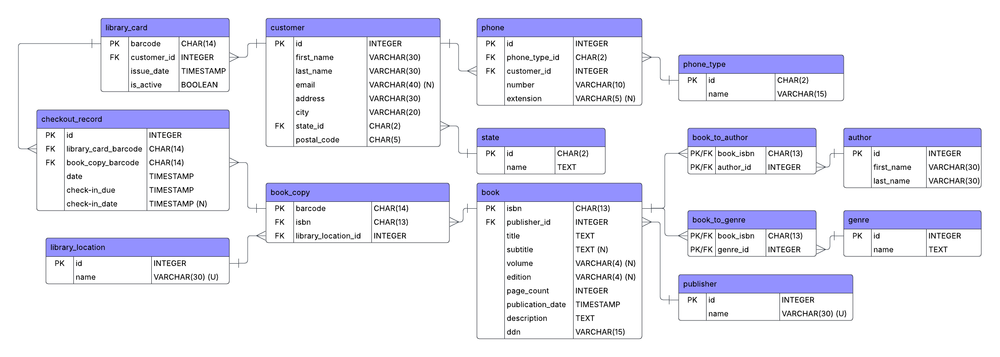

## LibMan API: Database Schema

### Version 1: Standard CRUD With Simple Entities

> [!NOTE]
> This version of the schema is based on a schema given in one of the classes I took in university. I mainly worked on transferring the structure of it into Spring and JPA.